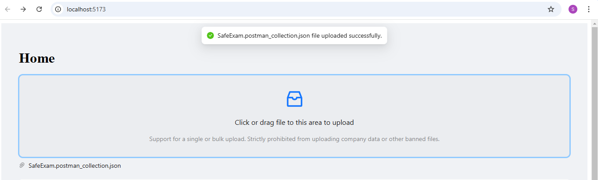
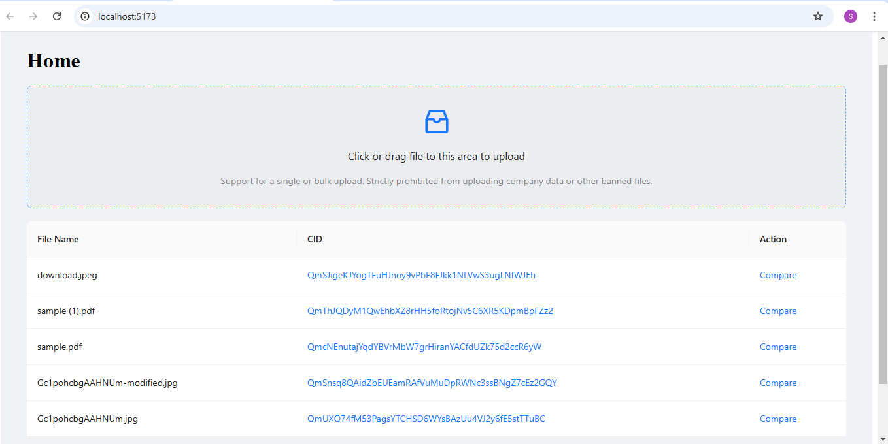
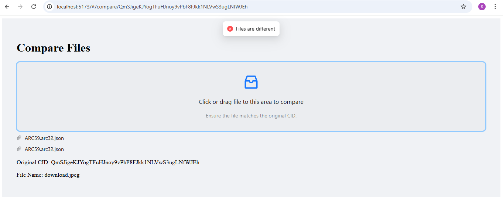

# IPFS File Comparison Tool

A web application for uploading files to IPFS via Pinata and comparing Files using IPFS content identifiers (CIDs). Built with React, TypeScript, and Express.js.

## Features

- File upload to IPFS using Pinata service
- View list of uploaded files with their CIDs
- Compare files using their IPFS CIDs
- Drag-and-drop file upload interface
- Direct IPFS gateway links for uploaded files
- Real-time upload status notifications

## Tech Stack

- **Frontend:**
  - React
  - TypeScript
  - Ant Design UI Framework
  - React Router
  - Multiformats (for CID handling)

- **Backend:**
  - Express.js
  - TypeScript
  - Multer (file handling)
  - Pinata IPFS API

## Prerequisites

- Node.js (v20 or higher)
- npm or yarn
- Pinata account and JWT token

## Installation

1. Clone the repository:
```bash
git clone https://github.com/SatishGAXL/ipfs-comparision.git
cd ipfs-comparision
```

2. Install dependencies for both frontend and backend:
```bash
# Install frontend dependencies
cd frontend
npm install

# Install backend dependencies
cd ../backend
npm install
```

3. Configure environment variables:
   - Create `.env` file in the backend directory
   - Add your Pinata JWT token:
```
PINATA_JWT=your_pinata_jwt_token
```

## Running the Application

Use the provided batch script to run both frontend and backend servers from root directory:

```bash
./run.bat
```

For Windows, Just Double click `run.bat` file.

Or start them manually:

```bash
# Start backend server (from backend directory)
npm run dev

# Start frontend server (from frontend directory)
npm run dev
```

- Frontend runs on: http://localhost:5173
- Backend runs on: http://localhost:5172

## Project Structure

```
ipfs-comparision/
├── frontend/
│   ├── src/
│   │   ├── App.tsx
│   │   ├── Home.tsx
│   │   ├── Compare.tsx
│   │   ├── config.ts
│   │   └── main.tsx
├── backend/
│   ├── src/
│   │   ├── index.ts
│   │   └── config.ts
│   └── .env
└── run.bat
```

## Usage

1. Upload files using the drag-and-drop interface on the home page
    
2. View the list of uploaded files and their IPFS CIDs
    
3. Click "Compare" to verify file integrity against existing IPFS content
    
4. Use the IPFS gateway links to view files directly on IPFS

## API Endpoints

- `GET /get-files`: Retrieve list of pinned files from Pinata
- `POST /upload-file`: Upload file to IPFS via Pinata

## Security Note

Keep your Pinata JWT token secure and never commit it directly to the repository.
